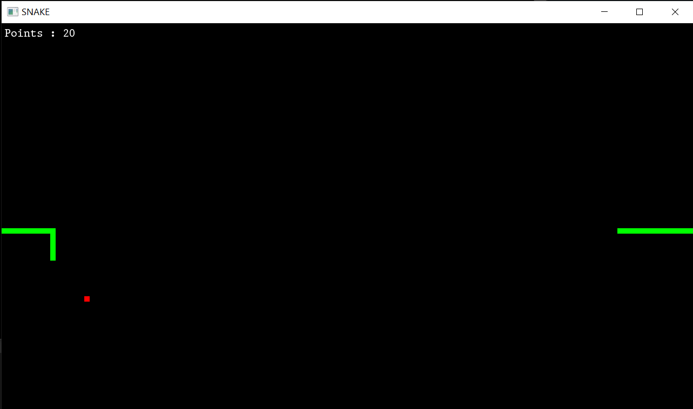

# snake_cpp

## Simple Snake game I made with C++ and SFML

This is an old high-school project of mine & the first time I programmed a 2D game.

To run the game, use the snake.exe application in snake_cpp\Release. The game should start with a welcome screen, to start playing press the 'enter' key.

You can change the direction of the snake by pressing the WASD keys. Once started it moves at a constant pace, which is easy to manage at the start, but the difficulty rises when the tail is very long.
When is heading to the window's edge, it will emerge form the opposite side of the screen.

Food will spawn in random locations. A collision between the snake and the food will grow the snake, increase your score and respawn the food in a new location.

When the head of the snake hits an element of the tail, you lose and the Game Over screen is triggered. 

The objective is simple: get the highest score possible
